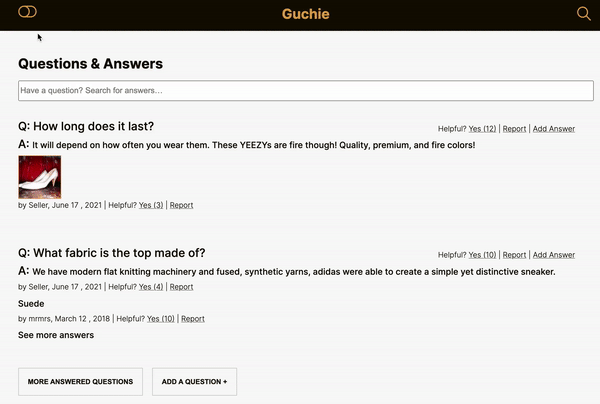

<h1 align="center">
  Fusilli - Project CatWalk 😺
  <br><br>
  
  <br>
</h1>

<p align="center" style="font-size: 1.4rem;">A 21st century solution to all your shopping needs.</p>

<hr />

## The problem

Our outdated client-facing retail web-portal has become significantly outdated and is hurting sales. Project Catwalk is a complete redesign of the retail portal designed to address this concern and modernize the site. This document outlines the features to be implemented as part of Project Catwalk.

## This solution

A client facing product detail page with a product overview, related products image slider, questions and answers, and a reviews and rating.

## Table of Contents

- [The problem](#the-problem)
- [This solution](#this-solution)
- [Table of Contents](#table-of-contents)
- [Overview](#Overview)
- [Installation](#installation)
- [Components](#Components)
- [Contributors](#contributors)

## Overview

- E-commerce site built with React hooks, React Context API, Node.js and Express
- Light and dark theme mode utilizing CSS modules
- Deploy with AWS EC2 instance (t2.micro), with 0.6 sec First Content Paint
- 4 distinct components with there own unique challenges

## Installation

```
npm install

npm start

npm run build
```

## Components

Each team member was responsible for a component with its own set of unique business requirements. A brief introduction and component highlights are available below.

### Product Overview by Diego Coronel

### Intro

The

### Product Overview Breakdown


### Related Products by Tristan Lerisse

### Intro

### Related Products Breakdown


### Questions & Answers by Warren Wong

### Intro

The questions and answer component allows the users to ask and answer questions for the product selected. This component utilized central state provided by React Context API and custom React hooks, coupled with CSS modules.

### Questions & Answers Breakdown

Per the business requirements this component includes 4 distinct sub components:

- Questions & Answers List View:
  - List will have the ability to expand and collapse with scroll ability
  - Questions will appear in order of 'helpfulness', corresponding to the how many users have indicated that the question was helpful
  - Questions list can be filtered through the search bar component
- Search Bar Capable:
  - Search terms entered will filter the list view for matching results
  - Search is dynamic and works with any filters
- Add a Question or Answer Forms:
  - On click a form modal will appear with an overlay
  - Mandatory inputs are labeled as such and will prevent missing or incomplete submissions
  - Submitted questions will be stored on external API and appear in either Questions or Answers list


### Ratings & Reviews by Mark P. Vale

### Intro

### Ratings & Reviews Breakdown


## Contributors

<table>
  <tr>
    <td align="center"><a href="https://github.com/WarrenWongCodes"><br /><sub><b>Warren Wong</b></sub></a><br /></td>
    <td align="center"><a href="https://github.com/diegochamilton"><br /><sub><b>Diego Coronel</b></sub></a><br /></td>
    <td align="center"><a href="https://github.com/lerisse"><br /><sub><b>Tristan Lerisse</b></sub></a><br /></td>
    <td align="center"><a href="https://github.com/markPVale"><br /><sub><b>Mark Vale</b></sub></td>
  </tr>
</table>
